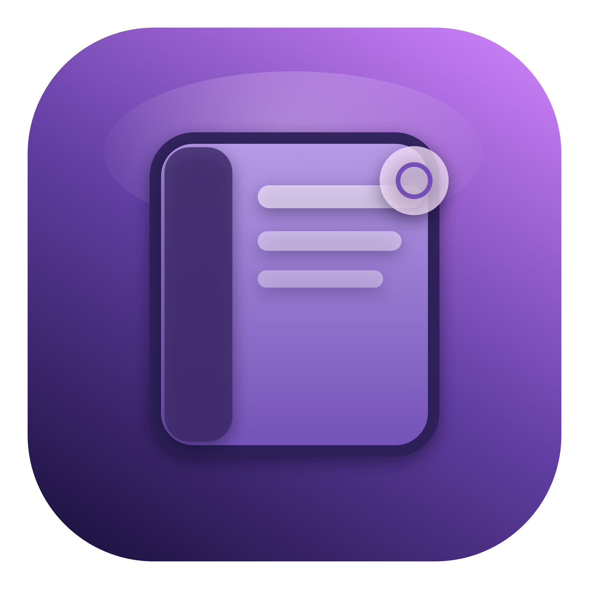
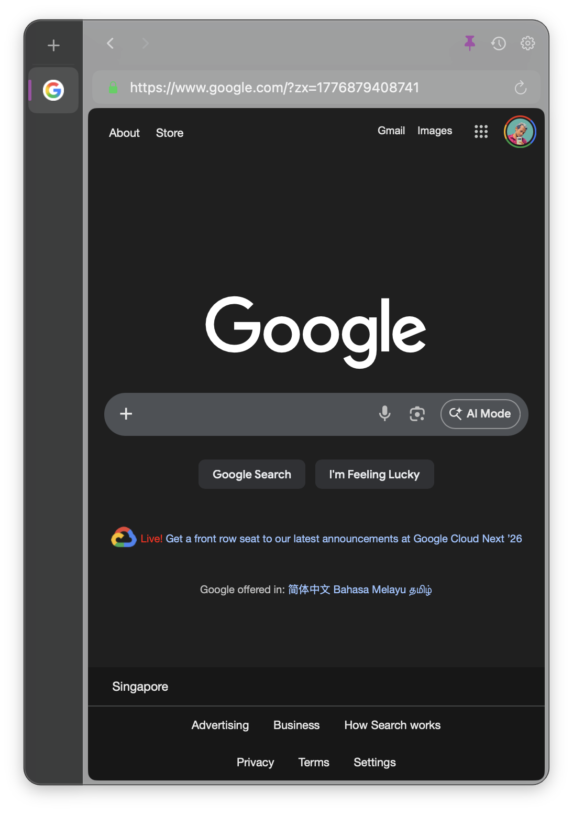
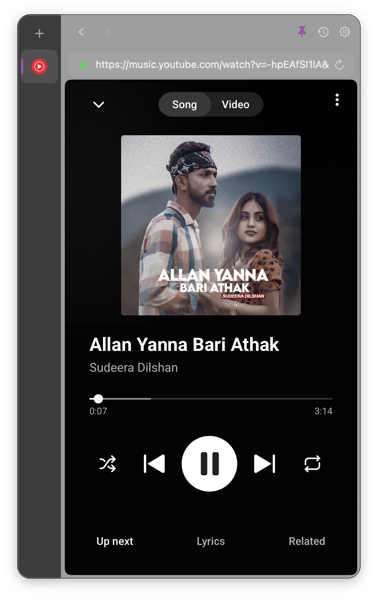
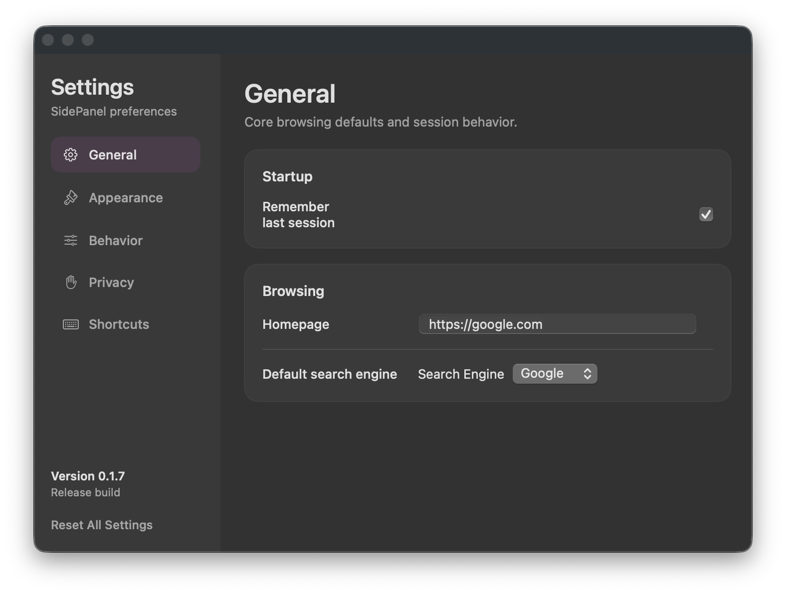

# SidePanel

<p align="center">
  
</p>

SidePanel is a native macOS floating browser panel built with SwiftUI, AppKit, and WebKit. It stays above other apps, supports pinned and hover-expanded modes, restores tabs and navigation state across relaunches, and keeps a compact browser surface available without taking over the desktop.

Current repository version: `0.1.7`

## Screenshots

### Browsing On The Homepage



### Media And Responsive Site Usage



### Collapsed Bubble Mode


### Settings Window



## What The App Does

- Keeps a floating browser panel visible above other windows with `NSPanel`
- Supports pinned mode, unpinned mode, and hover-to-expand bubble mode
- Restores tabs, active tab selection, and per-tab back/forward history
- Persists browsing history locally and exposes it from the toolbar
- Uses a minimal settings window for real app preferences only
- Applies adaptive fitting for narrow responsive pages inside the panel
- Registers global shortcuts through macOS Accessibility permission
- Runs as an accessory-style macOS app without a Dock icon or Cmd-Tab entry

## Requirements

- macOS 14 or later
- Xcode 15 or later if you want to open the package in Xcode

## Quick Start

Build and run directly with Swift Package Manager:

```bash
swift build
./.build/debug/SidePanel
```

This launches a GUI process from your shell, so the terminal stays attached while the app is running. Stop it with `Ctrl+C`.

If you prefer Xcode:

1. Open `Package.swift` in Xcode.
2. Select the `SidePanel` executable target.
3. Build and run.

## Using SidePanel

### Core Flow

1. Launch the app.
2. Browse in the floating panel as usual.
3. Use the pin control to keep the panel fixed open or collapse it into the circular bubble.
4. Hover the bubble to temporarily expand the panel.
5. Move away from the temporary panel to let it collapse again.

### Toolbar

The toolbar includes:

- Back
- Forward
- Pin or unpin
- History popover
- Settings

### Tabs

- Add tabs from the `+` button in the tab rail
- Switch between tabs from the left sidebar
- Close the current tab with the global shortcut
- Restored tabs reopen with their saved navigation history

### Settings

The current settings window is intentionally minimal. It contains:

- `General`
  - Remember last session
  - Homepage
  - Default search engine
- `Appearance`
  - Theme
  - Sidebar width
  - Transparency
- `Behavior`
  - Auto-collapse delay
  - Show on all spaces
- `Privacy`
  - Clear browsing history now
  - Clear history on quit
- `Shortcuts`
  - Shortcut list
  - Accessibility settings shortcut

Browsing history is not a settings tab. It is available from the toolbar history button.

## Keyboard Shortcuts

| Shortcut | Action |
| --- | --- |
| `Cmd+Shift+S` | Toggle sidebar |
| `Cmd+Shift+N` | New tab |
| `Cmd+Shift+W` | Close current tab |
| `Cmd+Shift+[` | Previous tab |
| `Cmd+Shift+]` | Next tab |
| `Cmd+Shift+L` | Focus address bar |

## Permissions

SidePanel uses Accessibility access for its global shortcuts.

On first launch:

1. Run the app.
2. Approve the macOS Accessibility prompt if it appears.
3. If the prompt does not appear, open `System Settings > Privacy & Security > Accessibility`.
4. Enable `SidePanel`.
5. Relaunch the app if macOS asks for it.

## Build, Test, And Package

### Run Unit Tests

```bash
swift test
```

### Create A Release Build

```bash
swift build -c release --product SidePanel
```

### Build The `.app` Bundle

```bash
./scripts/build_app_bundle.sh
```

This creates:

- `dist/SidePanel.app`

### Build The Installer Package

```bash
./scripts/build_pkg.sh
```

This creates:

- `dist/SidePanel-<version>.pkg`

### Run The Full Local Release Gate

```bash
./scripts/check.sh
```

This script currently runs:

1. version metadata sync
2. `swift test`
3. release build
4. app bundle build
5. installer package build

## Versioning

`version.txt` is the single source of truth for the app version.

To bump the version:

```bash
./scripts/bump_version.sh 0.1.8
```

That updates:

- `version.txt`
- `Sources/SidePanel/App/Info.plist`

The current settings window also shows the runtime version and build type.

## Signing And Notarization

Local builds use ad-hoc signing by default.

For Developer ID signing and notarization, provide the following environment variables:

- `CODESIGN_IDENTITY`
- `PKG_SIGN_IDENTITY`
- `APPLE_ID`
- `APPLE_TEAM_ID`
- `APPLE_APP_SPECIFIC_PASSWORD`

Manual notarization command:

```bash
./scripts/notarize_pkg.sh dist/SidePanel-$(cat version.txt).pkg
```

## Git Hooks

To enable the repository-managed pre-commit hook:

```bash
./scripts/setup-git-hooks.sh
```

That wires `.githooks/pre-commit` so commits run the repo quality gate before they land.

## GitHub Actions

### CI

Workflow: `.github/workflows/ci.yml`

- runs on pushes to `main` and `master`
- runs on pull requests
- executes `./scripts/check.sh`
- uploads `dist/*` as an artifact when available

### Release Automation

Workflow: `.github/workflows/release.yml`

- runs on pushes to `main` and `master`
- also supports manual dispatch
- only creates a release automatically when `version.txt` changed on that push, or when manually dispatched
- skips release creation if the corresponding tag already exists

When a release is created, the workflow:

1. runs `./scripts/check.sh`
2. zips `dist/SidePanel.app`
3. optionally notarizes the installer if Apple credentials are configured
4. creates SHA256 checksums
5. tags the repo as `v<version>`
6. publishes a GitHub release with the `.pkg`, `.zip`, and checksum file

## Data Storage

The app currently stores data locally:

- open tabs in SwiftData
- session and window state in app preferences
- browsing history in app preferences
- user settings in `UserDefaults`

## Project Layout

```text
Sources/
  SidePanel/
    App/
    Data/
    Tabs/
    UI/
      Components/
      Settings/
      Views/
    Utils/
    Web/
    Window/

Tests/
  SidePanelTests/

Assets/
  AppIcon/

docs/
  screenshots/
```

## License

MIT
