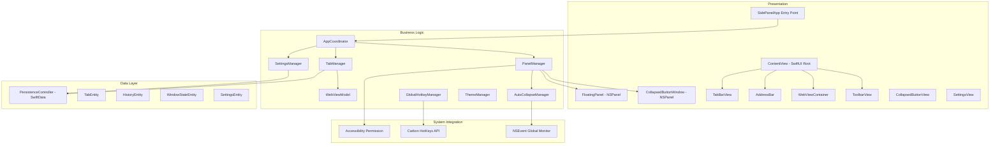
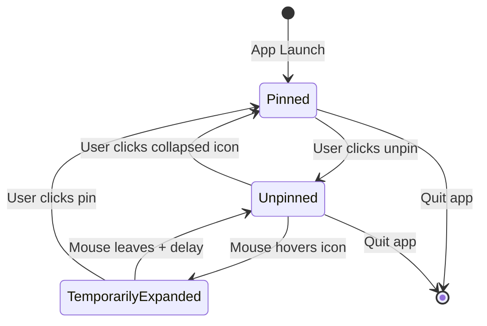

# SidePanel macOS App - Implementation Plan

## Overview

SidePanel is a native macOS floating sidebar browser that stays on top of all windows, provides full web browsing via WKWebView, supports pin/unpin collapse behavior, and integrates deeply with macOS through global hotkeys and accessibility permissions. The existing [`SIDEPANEL_MACOS_APP_SPECIFICATION.md`](../SIDEPANEL_MACOS_APP_SPECIFICATION.md) provides an extensive blueprint -- this plan turns it into ordered, actionable implementation steps.

**Stack:** Swift 5.9+, SwiftUI, AppKit (NSPanel), WebKit (WKWebView), SwiftData, Combine, Carbon HotKeys  
**Target:** macOS 14.0+ (Sonoma)  
**Architecture:** MVVM + Coordinator  

---

## Architecture Diagram

## State Machine: Panel Lifecycle

---

## Phase 1: Xcode Project Scaffold and Floating Window

### Step 1.1 -- Create Xcode project
- New macOS App project named `SidePanel`
- SwiftUI lifecycle, Swift language, macOS 14.0 deployment target
- Configure `Info.plist`: set `LSUIElement = YES` so the app runs as accessory (no Dock icon)
- Add entitlements for App Sandbox with outgoing network connections enabled
- Set up folder structure matching the spec's file tree under `SidePanel/`

### Step 1.2 -- Implement FloatingPanel (NSPanel subclass)
- Create `Window/FloatingPanel.swift` extending `NSPanel`
- Style: borderless, nonactivatingPanel, resizable, utilityWindow
- Level: `.floating`
- CollectionBehavior: `canJoinAllSpaces`, `fullScreenAuxiliary`, `ignoresCycle`
- `isMovableByWindowBackground = true`, transparent background, shadow enabled
- Override `canBecomeKey` to return `true` (for text input), `canBecomeMain` to return `false`

### Step 1.3 -- Implement CollapsedButtonWindow
- Create `Window/CollapsedButtonWindow.swift` extending `NSPanel`
- 64x64 borderless, nonactivatingPanel, floating level
- Transparent background, movable by background
- Displays favicon or default globe icon inside a circle

### Step 1.4 -- Implement PanelManager
- Create `Window/PanelManager.swift` as `ObservableObject` singleton
- Manages the `PanelState` enum: `.pinned`, `.unpinned`, `.temporarilyExpanded`
- Creates and shows/hides `FloatingPanel` and `CollapsedButtonWindow`
- Hosts SwiftUI `ContentView` via `NSHostingController`
- Handles position defaults: right edge of screen, 85% height
- Exposes `toggle()`, `pin()`, `unpin()` methods

### Step 1.5 -- Create AppDelegate and app entry point
- `App/AppDelegate.swift` using `NSApplicationDelegateAdaptor`
- On `applicationDidFinishLaunching`: initialize `PanelManager`, show panel
- `App/SidePanelApp.swift` as `@main` entry with no default `WindowGroup` (panel-only app)

---

## Phase 2: Core UI Shell

### Step 2.1 -- Design system foundations
- `Utils/ColorExtensions.swift` -- dark and light color palettes from spec
- `Utils/FontExtensions.swift` -- typography scale
- `Utils/LayoutMetrics.swift` -- spacing constants, window dimensions
- `Utils/AnimationConfig.swift` -- spring and easeOut presets
- `UI/Components/GlassBackground.swift` -- semi-transparent blur background modifier

### Step 2.2 -- ContentView and layout structure
- `UI/Views/ContentView.swift` -- root view with horizontal layout:
  - Left: `TabBarView` (narrow vertical strip, 56px)
  - Center: `WebViewContainer` (fills remaining space)
  - Top overlay: `ToolbarView` with pin/settings buttons + `AddressBar`

### Step 2.3 -- ToolbarView
- `UI/Views/ToolbarView.swift`
- Pin/unpin toggle button (pin icon changes state)
- Settings gear button (opens settings sheet)
- Navigation controls: back, forward, refresh
- Glassmorphism background

### Step 2.4 -- CollapsedButtonView
- `UI/Views/CollapsedButtonView.swift`
- Circle with favicon or globe icon
- Hover ring animation
- Tap to toggle pinned state

---

## Phase 3: WebView Integration

### Step 3.1 -- WKWebView configuration
- `Web/WebViewConfiguration.swift` -- factory for `WKWebViewConfiguration`
- Enable JavaScript, media playback without user action
- Safari-compatible user agent string
- Shared `WKProcessPool` across tabs for cookie/session sharing

### Step 3.2 -- WebView SwiftUI wrapper
- `Web/WebViewManager.swift` -- `NSViewRepresentable` wrapping `WKWebView`
- Bindings for URL, title, favicon, loading state, estimated progress
- `Web/WebViewCoordinator.swift` -- `WKNavigationDelegate` + `WKUIDelegate`
- Handle page load finish (update title/favicon), errors, new window requests (open as new tab)
- Handle download requests via standard macOS dialogs

### Step 3.3 -- AddressBar
- `UI/Views/AddressBar.swift`
- TextField with URL parsing and search fallback (prepend Google search URL)
- Security lock icon (green for HTTPS, orange otherwise)
- Cmd+L keyboard shortcut to focus
- Loading progress bar (thin line beneath bar)

### Step 3.4 -- WebViewContainer
- `UI/Views/WebViewContainer.swift`
- Displays the active tab's `WKWebView`
- Swaps view when active tab changes
- Shows loading indicator overlay during page load

---

## Phase 4: Tab System

### Step 4.1 -- Tab data model
- `Tabs/Tab.swift` -- SwiftData `@Model` class
- Fields: id, url, title, faviconURL, createdAt, lastAccessedAt, order, isPinned, isMuted
- Transient properties: webView reference, isLoading, estimatedProgress

### Step 4.2 -- TabManager
- `Tabs/TabManager.swift` -- `@MainActor ObservableObject`
- CRUD: `createTab()`, `closeTab()`, `activateTab()`, `reorderTabs()`
- Enforces max 50 tabs, closes oldest unpinned when exceeded
- Lazy WKWebView initialization (only create webview when tab is activated)
- `Tabs/TabPersistence.swift` -- save/load from SwiftData
- `Tabs/TabDragDrop.swift` -- drag-and-drop reordering support

### Step 4.3 -- TabBarView
- `UI/Views/TabBarView.swift` -- vertical scrollable list
- `UI/Views/TabButton.swift` -- individual tab row
  - Shows favicon (20x20), close button on hover
  - Active tab highlighted background
  - Tooltip with page title on hover
- New tab button at top (+ icon)
- Context menu on right-click: Close, Duplicate, Pin/Unpin, Mute

---

## Phase 5: Pin/Unpin and Auto-Collapse

### Step 5.1 -- Pin/unpin state transitions
- Wire `PanelManager` to animate between expanded panel and collapsed icon
- Use spring animation for expand/collapse transition
- Remember collapsed icon position independently from panel position

### Step 5.2 -- AutoCollapseManager
- `Utils/AutoCollapseManager.swift`
- Uses `NSEvent.addGlobalMonitorForEvents(matching: .mouseMoved)` to track cursor
- When unpinned and mouse hovers collapsed icon: temporarily expand panel
- When mouse leaves panel area: start configurable delay timer (default 2s), then collapse
- Cancel timer if mouse re-enters

### Step 5.3 -- WindowPositionManager
- `Window/WindowPositionManager.swift`
- Track panel position per screen (multi-display support)
- Snap to screen edges
- Restore position on app relaunch
- Handle display configuration changes (screen added/removed)

---

## Phase 6: Data Persistence and Session Management

### Step 6.1 -- SwiftData container setup
- `Data/PersistenceController.swift`
- Schema: TabEntity, HistoryEntity, WindowStateEntity, SettingsEntity
- Auto-save timer every 30 seconds
- Save on `applicationWillTerminate`

### Step 6.2 -- Session restoration
- `Data/SessionManager.swift`
- On launch: restore all tabs, active tab, window position, pin state
- On quit: save complete session state
- Handle crash recovery (periodic saves act as checkpoints)

### Step 6.3 -- Browsing history
- `Data/HistoryManager.swift`
- Record URL + title + timestamp on each navigation
- Increment visit count for repeat URLs
- Provide autocomplete data for address bar
- Option to clear on quit (privacy setting)

---

## Phase 7: Global Keyboard Shortcuts

### Step 7.1 -- GlobalHotkeyManager
- `Utils/GlobalHotkeyManager.swift`
- Use Carbon `RegisterEventHotKey` API for system-wide shortcuts
- Default shortcuts:
  - Cmd+Shift+S: toggle sidebar
  - Cmd+Shift+N: new tab
  - Cmd+Shift+W: close current tab
  - Cmd+Shift+[/]: previous/next tab
  - Cmd+Shift+L: focus address bar
- Route actions through `NotificationCenter` to decouple from UI

### Step 7.2 -- Accessibility permission handling
- `Utils/PermissionManager.swift`
- Check `AXIsProcessTrustedWithOptions` on launch
- Show clear explanation dialog if not granted
- Deep-link to System Preferences > Privacy > Accessibility
- Graceful degradation: app works without hotkeys, just no global shortcuts

---

## Phase 8: Settings and Preferences

### Step 8.1 -- SettingsManager
- `Data/SettingsManager.swift` -- `ObservableObject` backed by SwiftData
- Properties: theme, search engine, sidebar width, collapse delay, launch at login, privacy options
- Publish changes via Combine for reactive UI updates

### Step 8.2 -- Settings UI
- `UI/Settings/SettingsView.swift` -- tabbed settings window
- Tabs: General, Appearance, Behavior, Privacy, Shortcuts
- Each tab as separate SwiftUI view
- `GeneralSettingsView`: launch at login, default search engine, download location
- `AppearanceSettingsView`: theme (auto/dark/light), transparency slider, sidebar width
- `BehaviorSettingsView`: collapse behavior, auto-collapse delay, float position
- `PrivacySettingsView`: clear history on quit, do-not-track, cookie policy
- `ShortcutsSettingsView`: shortcut recorder for each action

### Step 8.3 -- Theme system
- `Utils/ThemeManager.swift`
- Respond to system appearance changes
- Apply color palette based on auto/dark/light setting
- Respect system accent color

---

## Phase 9: Polish and Edge Cases

### Step 9.1 -- Animations and micro-interactions
- Smooth spring animations for pin/unpin transitions
- Tab switch crossfade
- Address bar focus/blur transitions
- Loading progress bar animation
- Hover effects on all interactive elements
- Respect macOS "Reduce Motion" accessibility setting

### Step 9.2 -- Menu bar integration
- Status bar item (optional, configurable) as alternative access point
- Right-click menu: Toggle Panel, New Tab, Settings, Quit
- Standard macOS menu bar with Edit menu (for copy/paste in webview)

### Step 9.3 -- Edge cases
- Handle full-screen apps (panel as `fullScreenAuxiliary`)
- Multi-display: panel follows active display or stays on assigned display
- Very long tab titles: truncate with ellipsis
- WebView error pages: show friendly error with retry button
- Handle `target="_blank"` links: open in new tab
- Handle downloads: pass through to macOS standard download dialog
- Handle authentication prompts from websites

### Step 9.4 -- Accessibility
- VoiceOver labels on all interactive elements
- Full keyboard navigation (Tab key cycles through controls)
- Respect "Reduce Transparency" for glassmorphism backgrounds
- Minimum font size option in settings

---

## Phase 10: Testing

### Step 10.1 -- Unit tests
- `TabManagerTests`: create, close, reorder, max limit, pinned tabs
- `PanelManagerTests`: state transitions, position persistence
- `SettingsManagerTests`: defaults, persistence, reactive updates
- `HistoryManagerTests`: recording, visit counts, clearing
- `SessionManagerTests`: save and restore

### Step 10.2 -- UI tests
- New tab creation flow
- Address bar navigation
- Pin/unpin toggle
- Tab switching
- Settings changes

### Step 10.3 -- Manual testing checklist
- Panel stays on top across all apps and Spaces
- Panel does not appear in Dock or Cmd+Tab
- Global shortcuts work from any app
- Session restores correctly after quit and relaunch
- Multi-display behavior
- Performance: idle CPU under 5%, memory under 500MB for 10 tabs

---

## Phase 11: Distribution

### Step 11.1 -- Build and sign
- Configure code signing with Developer ID
- Enable Hardened Runtime
- Notarize with Apple

### Step 11.2 -- Package
- Create DMG with drag-to-Applications layout
- Custom DMG background image
- Write README with installation instructions and permission setup guide

### Step 11.3 -- Release
- Create GitHub release with DMG artifact
- Write changelog
- Add screenshots/GIF demo to README

---

## Key Technical Risks and Mitigations

| Risk | Mitigation |
|------|-----------|
| NSPanel not staying above full-screen apps | Use `.fullScreenAuxiliary` collection behavior; test thoroughly |
| Global hotkeys require Accessibility permission | Graceful fallback; clear first-run permission dialog |
| WKWebView memory with many tabs | Lazy initialization; suspend inactive tabs; enforce max tab limit |
| Carbon HotKeys API is legacy | Consider `HotKey` Swift package as wrapper; monitor for deprecation |
| SwiftData maturity on macOS 14 | Fall back to UserDefaults for settings if SwiftData has issues |
| App rejected from notarization | Ensure proper entitlements; no private API usage |

---

## File Creation Order

For implementation, files should be created roughly in this order to ensure each piece has its dependencies available:

1. Project scaffold + `Info.plist` + entitlements
2. `LayoutMetrics`, `ColorExtensions`, `FontExtensions`, `AnimationConfig`
3. `FloatingPanel`, `CollapsedButtonWindow`
4. `PanelManager`, `PanelState`
5. `SidePanelApp`, `AppDelegate`
6. `GlassBackground`, `ContentView`, `ToolbarView`
7. `WebViewConfiguration`, `WebViewCoordinator`, `WebViewManager`
8. `Tab` model, `TabManager`, `TabPersistence`
9. `TabBarView`, `TabButton`, `AddressBar`, `WebViewContainer`
10. `CollapsedButtonView`, `AutoCollapseManager`
11. `WindowPositionManager`
12. `PersistenceController`, `SessionManager`, `HistoryManager`
13. `GlobalHotkeyManager`, `PermissionManager`
14. `SettingsManager`, `ThemeManager`, Settings UI views
15. Tests
16. Distribution assets (DMG script, README)
